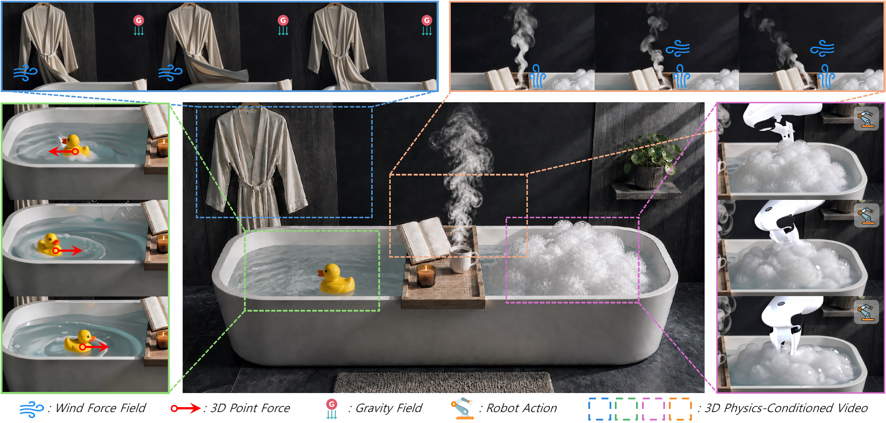

# 3DPhysVideo: Consistency-Guided Flow SDE for Video Generation via 3D Scene Reconstruction and Physical Simulation

<p align="center">
  <a href="https://hwidong-kim.github.io/">Hwidong Kim</a><sup>*</sup>,
  &nbsp;<a href="https://yunho0421.vercel.app/about">Yunho Kim</a><sup>*</sup>,
  &nbsp;<a href="https://sites.google.com/view/tkkim/home">Tae-Kyun Kim</a>
</p>

<p align="center">
  <strong>KAIST</strong>
</p>

<p align="center">
  
  
  <a href="https://hdkim01.github.io/projects/3DPhysVideo/">
    
  </a>
</p>

---

<p align="center">
  
</p>

## Code Release

🚧 Code release coming soon. Please ⭐ star or watch this repository for updates.

## Citation

```bibtex
@article{kim20263dphysvideo,
  title   = {3DPhysVideo: Consistency-Guided Flow SDE for Video Generation
             via 3D Scene Reconstruction and Physical Simulation},
  author  = {Kim, Hwidong and Kim, Yunho and Kim, Tae-Kyun},
  journal = {arXiv preprint},
  year    = {2026},
}
```
